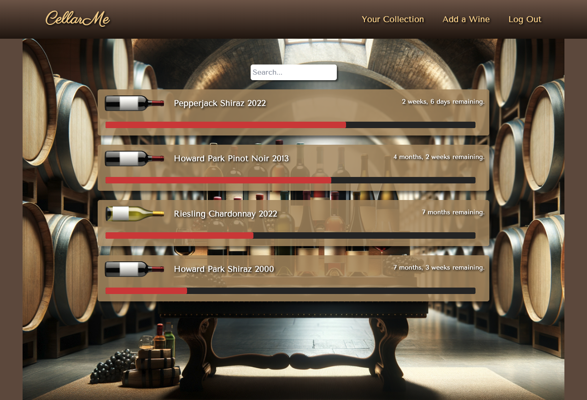
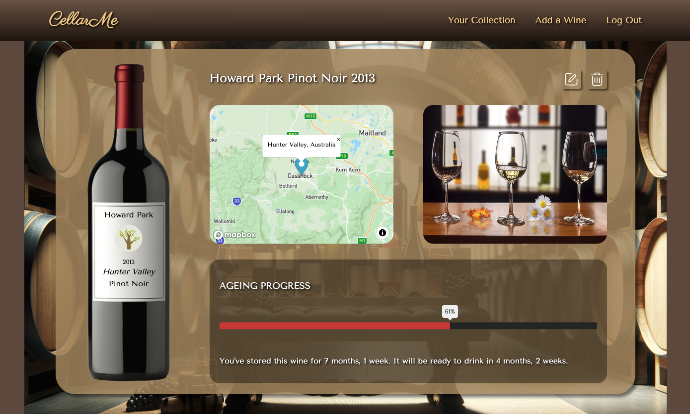

# CellarMe
> A wine enthusiasts best friend - track and manage your ageing wines with ease.
> Live demo [_here_](https://cellarme-5e3b293d0088.herokuapp.com/).

## Table of Contents
* [General Info](#general-information)
* [Technologies Used](#technologies-used)
* [Features](#features)
* [Screenshots](#screenshots)
* [Project Status](#project-status)
* [Room for Improvement](#room-for-improvement)
* [Acknowledgements](#acknowledgements)


## General Information
- This Project is my final of four major projects submitted during the General Assembly Software Engineering Bootcamp
- CellarMe is a simple web app intended for not only wine enthusiasts, but also those who are new to the art of ageing fine wine
- Particularly for those with a large collection of ageing wines - keeping track of the ageing progress is difficult. Without proper management, many wines can be spoiled if left to age for too long.
- CellarMe simplifies this process. Users add their wine to the database along with details of the intended ageing window and the app takes care of the rest.
- CellarMe provides a visual representation of the ageing progress of each wine in your collection, giving users a clear picture of where their wines are at and when they'll be ready to drink.
- The platform is very much in a foundational state - with many more features coming soon that will further bolster it's ability to users manage their collection, such as:
  - Receive notifications when wines are nearing the end of their ageing window
  - Connect to an api so users can search for the wine they want to add, rather than manually adding the details
  - Ability to 'drink' wines and leave tasting notes for future reference
  - Ability to 'favourite' specific wines


## Technologies Used
- ```Python, HTML, CSS, HTMX, TailwindCss```
- ```Django, PostgreSQL```
- ```Heroku```


## Features

- User Authentication
- Wine index page to visualise the ageing progress of your wines
- Search for wines by type, producer, variety, year, region etc.
- Add and edit wines to track and manage:
  - Ageing window (months)
  - Storage date
  - Wine details


## Screenshots




## Project Status
Project is: _in progress_.

CellarMe is very much in a fundamental state, offering only the ability to manually add wines and visualise their ageing progress. Planned features coming soon include:
- Receive notifications when wines are nearing the end of their ageing window
- Connect to an api so users can search for the wine they want to add, rather than manually adding the details
- Ability to 'drink' wines and leave tasting notes for future reference
- Ability to 'favourite' specific wines


## A Work In Progress

Having spent only a limited amount of time on this project so far, there are many areas that could be further improved upon. This project will be a continual work in progress, with various features and improvements (listed above) to be added along the way.

## Attributions
- https://pixabay.com/
- https://deepai.org/
- https://www.svgrepo.com/
- https://www.mapbox.com/
- https://tailwindcss.com/
- https://dribbble.com/


## Acknowledgements
- This project makes up the submission for my final of four major projects during the General Assembly Software Engineering Bootcamp
- Many thanks to Joel and CJ for their expert instruction and guidance along the way